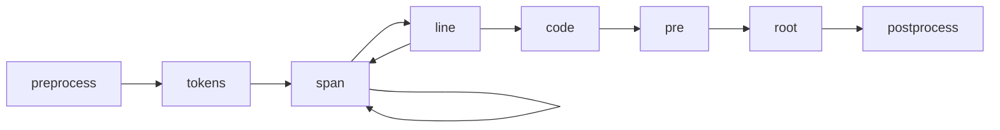

# 代码变换器（Transformers）

Shiki 使用 [`hast`](https://github.com/syntax-tree/hast) —— 一种用于 HTML 的 AST 格式 —— 来处理结果并生成 HTML。

你可以提供自己的 `transformers`，通过操作 hast 树自定义生成的 HTML。可以为不同类型的节点传入自定义函数来修改它们。例如：

```ts twoslash
import { codeToHtml } from 'shiki'

const code = await codeToHtml('foo\bar', {
  lang: 'js',
  theme: 'vitesse-light',
  transformers: [
    {
      code(node) {
        this.addClassToHast(node, 'language-js')
      },
      line(node, line) {
        node.properties['data-line'] = line
        if ([1, 3, 4].includes(line))
          this.addClassToHast(node, 'highlight')
      },
      span(node, line, col) {
        node.properties['data-token'] = `token:${line}:${col}`
      },
    },
  ]
})
````

我们也提供了一些常用的变换器，详见 [`@shikijs/transformers`](/packages/transformers) 和 [`@shikijs/colorized-brackets`](/packages/colorized-brackets)。

## 变换器钩子（Transformer Hooks）



* `preprocess` - 在代码分词前调用，你可以用它在分词前修改代码。
* `tokens` - 在代码分词后调用，你可以用它修改 tokens。
* `span` - 对每个 token 的 `<span>` 标签调用。
* `line` - 对每行的 `<span>` 标签调用。
* `code` - 对包裹所有行的 `<code>` 标签调用。
* `pre` - 对包裹 `<code>` 标签的 `<pre>` 标签调用。
* `root` - HAST 树的根节点，通常只有一个子节点 `<pre>`。
* `postprocess` - 在 HTML 生成后调用，可以修改最终输出。在 `codeToHast` 中不会调用。

## 元信息（Meta）

在 [支持的集成](/guide/install#integrations) 中，变换器也可以访问 markdown 的 meta 字符串。

<!-- eslint-skip -->

````markdown
<!-- [!code word:meta=here] -->
```html foo=bar baz-qux="qu ux"
````

你可以这样访问原始 meta：

<!-- eslint-skip -->

```ts
this.options.meta
// => { __raw: 'foo=bar baz-qux="qu ux"' }
```
